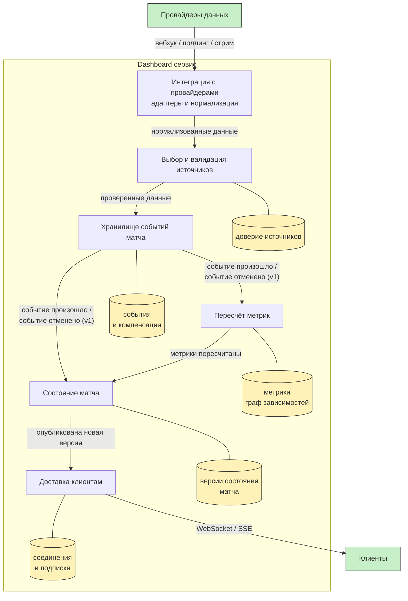

# Диаграмма сервисов + пример DIP

### Что здесь видно

У каждого сервиса своё хранилище и общей БД нет, поэтому чужие данные можно взять только по стрелке, то есть по контракту. На стрелках не вызовы методов, а события с именами, причём хранилище событий отдаёт их с версией контракта(v1) и за счёт этого может менять свой внутренний формат как угодно.

### Пример DIP

DIP говорит, что модули верхнего уровня не должны зависеть от модулей нижнего уровня, оба зависят от абстракции, и эта абстракция принадлежит верхнему уровню. У нас верхний уровень это [выбор и валидация источников](05-service-boundaries.md) (`ARB`), он про доменное решение "каким данным верить". Нижний уровень - конкретные провайдеры со своими вебхуками, поллингом и форматами, и работа с ними вынесена в [интеграцию с провайдерами](05-service-boundaries.md) (`INT`).

Если сделать в лоб, то сервис выбора источников будет знать про каждого провайдера: как к нему подключиться, как разобрать его json. Тогда каждый новый провайдер это правка ядра, а ядро у нас core-поддомен и трогать его хочется как можно реже.

Поэтому зависимость переворачиваем. Интерфейс `DataSource` объявляет у себя `ARB` - он владелец абстракции, потому что это его домен диктует, что ему нужно от источника. А реализуют этот интерфейс адаптеры внутри `INT`, по одному на провайдера:

- `subscribe()` - отдаёт поток нормализованных данных
- `state()` - источник живой или упал
- `position(data)` - на каком месте в потоке мы остановились, чтобы после сбоя не потерять и не продублировать данные

Получается, что стрелка зависимости идёт от адаптеров к домену, а не наоборот, хотя данные на диаграмме текут в обратную сторону, от `INT` к `ARB`. Новый провайдер теперь это новый адаптер в `INT` и ядро не меняется
