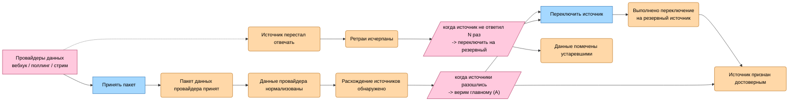
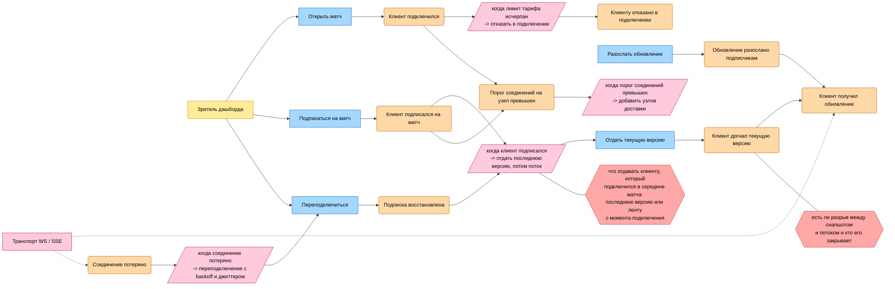
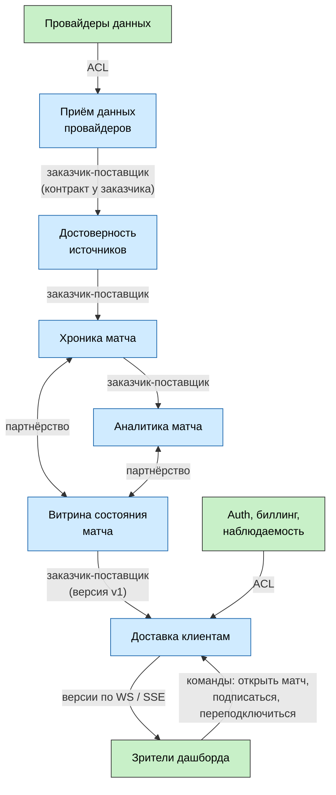

# Event Storming: границы через события

Здесь я заново нахожу границы, но уже не сверху вниз от возможностей, как в [04-capabilities.md](04-capabilities.md) и [05-service-boundaries.md](05-service-boundaries.md), а снизу вверх - от того, что реально происходит по ходу матча. Сначала выписываю события, потом смотрю, во что они сами собираются, и только в конце сверяюсь с прошлым разбором.

## Шаг 1. Доска Event Storming

Нотация обычная: оранжевый - доменное событие в прошедшем времени, синий - команда, жёлтый - актор, розовый - политика или внешняя система, красный - спорное место, где надо договориться.

Доска разбита на три куска, иначе в один экран не влезает. Первые два - это таймлайн матча, время в них идёт слева направо. Третий про клиента и идёт параллельно второму: у соединения свой жизненный цикл, который с минутами матча не совпадает.

### Фаза 1. Приём данных и выбор источника

### Фаза 2. Ход матча, отмена и доставка

```mermaid
flowchart LR
    VAR[Судья VAR]:::actor
    PROV2[Провайдер]:::ext

    C1[Зафиксировать событие]:::cmd
    C2[Отменить событие]:::cmd
    C3[Пересчитать метрики]:::cmd
    C4[Опубликовать версию]:::cmd
    C5[Разослать обновление]:::cmd

    E1(Гол зафиксирован):::evt
    E2(Карточка показана):::evt
    E3(Замена проведена):::evt
    E4(Гол отменён по VAR):::evt
    E5(Зависимые метрики<br/>признаны устаревшими):::evt
    E6(xG пересчитан):::evt
    E7(Владение пересчитано):::evt
    E8(Версия состояния матча собрана):::evt
    E9(Версия опубликована):::evt
    E10(Обновление разослано подписчикам):::evt
    E11(Матч завершён):::evt

    P1[/"когда событие отменено<br/>-> пересчитать зависимые метрики"/]:::pol
    P2[/"когда все зависимые метрики пересчитаны<br/>-> опубликовать новую версию"/]:::pol
    P3[/"когда версия опубликована<br/>-> разослать подписчикам"/]:::pol

    C1 --> E1
    C1 --> E2
    C1 --> E3
    C1 --> E11
    VAR --> PROV2
    PROV2 -.-> C2 --> E4
    E1 --> E5
    E4 --> P1 --> E5
    E5 --> C3
    C3 --> E6
    C3 --> E7
    E6 --> P2
    E7 --> P2
    P2 --> C4 --> E8 --> E9
    E9 --> P3 --> C5 --> E10

    H1{{"принимаем ли отмену<br/>после «Матч завершён»"}}:::hot
    E11 --- H1

    classDef evt fill:#ffd8a8,stroke:#b06000,color:#000
    classDef cmd fill:#a5d8ff,stroke:#1864ab,color:#000
    classDef pol fill:#ffc9de,stroke:#a61e4d,color:#000
    classDef ext fill:#ffc9de,stroke:#a61e4d,color:#000
    classDef actor fill:#ffec99,stroke:#e67700,color:#000
    classDef hot fill:#ffa8a8,stroke:#c92a2a,color:#000
```

### Фаза 3. Клиент: подключение, подписка, переподключение

Эта фаза не продолжает вторую по времени, а идёт с ней параллельно: рассылка(C5 и E4 из фазы 2) втыкается в середину клиентской истории, а всё остальное здесь живёт своим темпом - клиент подключается, теряет соединение и возвращается когда захочет, матч его при этом не ждёт.

### Что видно на доске

Акторов на доске два, и они смотрят в систему с разных концов. Судья VAR стоит в начале цепочки фактов и доходит до нас через провайдера. Зритель дашборда стоит в конце и шлёт команды напрямую: открыть матч, подписаться, переподключиться после обрыва.

От зрителя тянутся две политики, и для меня это главная находка доски. Первая - что отдавать при подписке: если просто подключить клиента к потоку, человек, зашедший на 60-й минуте, увидит пустой экран и дальше только новые голы. Значит при подписке сначала отдаём последнюю опубликованную версию, а поток идёт после неё. Вторая - переподключение: обрыв у клиента это норма, а не сбой, и если после падения узла 100к клиентов переподключатся одновременно и без джиттера, мы сами себе устроим второй пик поверх первого. Это ровно про драйвер D2 и сценарий S2 из [02-utility-tree.md](02-utility-tree.md): самое нагруженное место системы держится не на рассылке, а на входящих командах зрителя.

Оба вопроса я тут пока только фиксирую. Выбор между "последняя версия" и "лента с момента подключения" и вопрос про разрыв между снапшотом и потоком - это уже про модели взаимодействия, и там же станет понятно, кто держит позицию клиента в потоке. Моё направление - последняя версия плюс поток после неё, потому что обещание из [ADR-01](adr/01-functional-suitability-over-performance.md) сформулировано про согласованную версию, а не про ленту: клиенту важно видеть текущий счёт, а не историю с момента, когда он открыл вкладку.

Ещё видно, что события бывают двух видов. Одни рассказывают, что случилось на поле(гол, карточка, отмена): переписать их нельзя, можно только дописать рядом опровержение. Другие рассказывают, что случилось у нас внутри(пакет принят, источник признан достоверным, версия опубликована, клиент подписался): это уже про обработку, и переигрывать их можно сколько угодно. Клиентские события из фазы 3 попадают во вторую группу, но у них своя особенность: жить им столько же, сколько соединению. После обрыва запись "у этого соединения версия N" никому не нужна, тогда как факт с поля хранится всегда

Спорных мест на доске три, и все они про границы во времени. Первое - принимаем ли отмену после того, как матч уже завершён: провайдер может уточнить протокол и на следующий день, а история матча к этому моменту считается закрытой. Второе и третье - клиентские, из фазы 3: что отдавать подключившемуся в середине матча и есть ли разрыв между снапшотом и потоком. Остальное решено раньше: при устаревших данных продолжаем отдавать их с пометкой(S1 в [02-utility-tree.md](02-utility-tree.md)), а отмена по ходу матча разобрана в S5.

## Шаг 2. Bounded Context

Теперь обвожу события, которые ходят вместе. Критерий простой: если события всегда случаются одной цепочкой и говорят на одном языке - это один кластер. Получилось шесть.

### 1. Приём данных провайдеров

**События**: пакет данных провайдера принят, данные провайдера нормализованы.

**Язык**: пакет, сырое сообщение, адаптер, внешний id, позиция в потоке.

**Данные**: маппинг внешних id провайдеров на наши внутренние, позиция в потоке каждого провайдера.

Кластер держится вместе, потому что оба события про одно: чужой формат превратился в наш

### 2. Достоверность источников

**События**: источник перестал отвечать, ретраи исчерпаны, выполнено переключение на резервный источник, данные помечены устаревшими, расхождение источников обнаружено, источник признан достоверным.

**Язык**: главный и резервный источник, ретрай, живой/упавший, устаревшие данные, расхождение, достоверность.

**Данные**: кто из источников главный, состояние каждого источника, счётчик ретраев.

Внутри этого кластера видно два подкластера: "источник упал" и "источники расходятся". Я оставляю их в одном контексте, потому что обе политики отвечают на один вопрос - каким данным сейчас верить, - и обе смотрят в один и тот же список источников

### 3. Хроника матча

**События**: гол зафиксирован, карточка показана, замена проведена, гол отменён по VAR, матч завершён.

**Язык**: событие матча, минута, компенсирующее событие, порядок, хроника.

**Данные**: сама лента событий матча и компенсаций, дописывать можно только в конец.

Этот кластер - единственный, где события про поле, а не про нашу обработку. Здесь не знают, что такое xG, и не знают, кто из провайдеров главный: сюда данные приходят уже проверенными.

### 4. Аналитика матча

**События**: зависимые метрики признаны устаревшими, xG пересчитан, владение пересчитано.

**Язык**: метрика, проекция, зависимость "событие -> метрика", пересчёт.

**Данные**: значения метрик и граф зависимостей.

Кластер проступает из-за политики "когда событие отменено -> пересчитать зависимые метрики": она срабатывает на событиях хроники, но живёт своим знанием о том, что от чего зависит.

### 5. Витрина состояния матча

**События**: версия состояния матча собрана, версия опубликована.

**Язык**: версия, согласованность, публикация.

**Данные**: версии состояния матча.

Два события, но отдельный контекст, потому что у них своё правило: пока не пришли все пересчитанные метрики, версия не собирается. Это то самое обещание из [ADR-01](adr/01-functional-suitability-over-performance.md), и на доске хорошо видно, что политика "когда все метрики пересчитаны -> опубликовать" ждёт именно здесь.

### 6. Доставка клиентам

**События**: клиент подключился, клиент подписался на матч, клиент догнал текущую версию, обновление разослано подписчикам, клиент получил обновление, соединение потеряно, подписка восстановлена, порог соединений на узел превышен, клиенту отказано в подключении.

**Язык**: подписка, соединение, топик матча, рассылка, снапшот, позиция клиента, переподключение, узел доставки.

**Данные**: соединения и подписки, последняя доставленная клиенту версия, счётчики соединений по узлам.

Единственный контекст, кто знает про клиентов, и это не просто рассылка: половина событий здесь про жизненный цикл соединения, а не про отправку. Что внутри версии - ему при этом безразлично, он держит соединения и знает, кто на какой матч подписан.

Отдельно про "клиент догнал текущую версию": это событие про наше знание о клиенте, а не про клиента. Мы не можем наблюдать его экран, мы только знаем, какую версию ему отправили и что транспорт её подтвердил. Из-за этого кластер и не разваливается на два: и подписка, и рассылка опираются на одну и ту же запись "у этого соединения версия N".

Кластер соседний, но чужой - лимиты и тарифы. Событие "клиенту отказано в подключении" случается здесь, а решает его политика лимита тарифа, которая живёт в generic-подсистеме. Доставка про это только спрашивает.

### Один термин - разные модели

Два слова с доски, которые в разных контекстах означают разное, и это как раз то, что удерживает границы:

- **событие**: в приёме данных это пакет от провайдера, в хронике - факт с поля, в аналитике матча - триггер пересчёта, в доставке - сообщение в сокет
- **матч**: в хронике это лента фактов, в витрине - версия состояния, в доставке - топик, на который подписаны соединения
- **клиент**: в доставке это соединение с подпиской и последней доставленной версией, в биллинге - плательщик с тарифом и лимитом. Живут они разное время: соединение обрывается и создаётся заново десятки раз за матч, плательщик при этом остаётся тем же

Если попытаться сделать одну модель "события" на всех, придётся тащить в хронику поля провайдера, а в доставку - граф зависимостей метрик

## Шаг 3. Context Map

### Провайдеры -> Приём данных

У каждого провайдера свой формат, свои id игроков и команд, свой способ отдавать данные. Если пустить этот формат дальше, то про каждого провайдера придётся знать всей системе. Поэтому на входе стоит перевод: адаптер принимает чужую модель и отдаёт нашу.

Эта связь относится к типу **ACL**, так как чужая модель заканчивается на адаптере и внутрь не проходит.

### Приём данных -> Достоверность источников

Данные идут от приёма к достоверности, значит приём здесь поставщик, а достоверность заказчик. При этом контракт задаёт не поставщик, а заказчик: достоверность решает, что ей нужно от источника - поток нормализованных данных, признак "живой или упал" и позиция в потоке. Как именно адаптер это добудет, её не интересует, разбор такой перевёрнутой зависимости есть в [07-services-diagram.md](07-services-diagram.md).

Эта связь относится к типу **заказчик-поставщик**, причём контрактом владеет заказчик.

### Достоверность источников -> Хроника матча

Хроника получает уже проверенные данные и сама ничего не решает. Ей не важно, как выбрали достоверный источник: по главному провайдеру или иначе.

Эта связь относится к типу **заказчик-поставщик**: хроника принимает контракт достоверности и меняться под неё обязана она, а не наоборот.

### Хроника матча -> Аналитика матча

Аналитика подписана на события хроники версии v1 и стоит ниже по потоку. Хронике не нужно знать, что аналитика вообще существует: если её убрать, хроника продолжит работать так же.

Эта связь относится к типу **заказчик-поставщик**: события матча - это контракт хроники, аналитика под него подстраивается.

### Хроника матча и Аналитика матча <-> Витрина состояния

Здесь связь двусторонняя. Если появляется новая метрика, то меняется и аналитика, и формат версии в витрине, причём одновременно: иначе витрина соберёт версию без новой метрики и опубликует неполные данные. С другой стороны, витрина задаёт, какой набор метрик считать полным, и аналитика обязана сообщать, что пересчитала всё.

Эта связь относится к типу **партнёрство**, так как контекстам приходится развиваться согласованно и одним релизом.

Если две части всегда меняются вместе, это повод проверить, не один ли это контекст. Проверяю и всё-таки не сливаю: причины изменения у них разные(в аналитике меняются формулы метрик, в витрине - правило согласованности), профиль нагрузки тоже разный, аргумент тот же, что в [05-service-boundaries.md](05-service-boundaries.md). Но связанность в этом месте самая высокая на карте, и это основной риск декомпозиции.

### Витрина состояния -> Доставка клиентам

Доставка получает готовую версию и рассылает её как есть. Права трактовать содержимое версии у неё нет, иначе обещание согласованности из [ADR-01](adr/01-functional-suitability-over-performance.md) окажется сразу в двух местах.

Эта связь относится к типу **заказчик-поставщик**: версия состояния v1 - это опубликованный контракт витрины.

### Auth и биллинг -> Доставка клиентам

Авторизация, клиентские тарифы и клиентские лимиты - это сторонние generic-подсистемы. Тащить их модель внутрь доставки нельзя, иначе смена биллинга станет правкой доставки.

Эта связь относится к типу **ACL**: на входе чужой пользователь и чужой тариф превращаются в нашу подписку и наш лимит.

### Зрители <-> Доставка клиентам

Единственная двусторонняя связь с внешним миром: наружу идут версии состояния, внутрь - команды открыть матч, подписаться и переподключиться. Контракт здесь наш и публичный: формат версии, способ подписки и правило переподключения(с какой задержкой и с каким джиттером клиент возвращается). Клиентов много и они разные - веб, мобильные, чужие интеграции, - договориться с каждым отдельно нельзя, значит контракт менять можно только с обратной совместимостью.

Эта связь относится к типу **открытый протокол (Open Host Service)**: доставка держит один вход для всех клиентов вместо отдельной интеграции под каждого, а формат версии в этом протоколе - **опубликованный язык (Published Language)**, то есть общая модель, на которой мы с клиентами договариваемся. Обратная сторона в том, что политика переподключения тоже оказывается частью публичного протокола, а не нашей внутренней настройкой: клиент, который переподключается агрессивно, - это уже наша проблема с нагрузкой(D2, S2), а исправить её правкой только своего кода не получится.

## Шаг 4. Сверка с ДЗ-3

В ДЗ-3 я шёл сверху вниз: сначала выписал возможности в [04-capabilities.md](04-capabilities.md), потом нарезал по ним сервисы в [05-service-boundaries.md](05-service-boundaries.md). Сейчас шёл снизу вверх, от событий. Сравниваю, что получилось.

| Сервис из ДЗ-3                  | Контекст из ДЗ-4             | Итог                                    |
| ------------------------------- | ---------------------------- | --------------------------------------- |
| 1. Интеграция с провайдерами    | Приём данных провайдеров     | совпало                                 |
| 2. Выбор и валидация источников | Достоверность источников     | совпало, но граница чуть не разъехалась |
| 3. Хранилище событий матча      | Хроника матча                | совпало, добавилось "матч завершён"     |
| 4. Пересчёт метрик              | Аналитика матча              | совпало                                 |
| 5. Состояние матча              | Витрина состояния матча      | совпало                                 |
| 6. Доставка клиентам            | Доставка клиентам            | совпало, но контекст сильно вырос       |
| Возможность 7 (generic)         | Auth, биллинг, наблюдаемость | разошлось: контекст появился на карте   |

### Расхождение 1. Generic-контексты стали видимыми

В ДЗ-3 авторизация, биллинг и наблюдаемость сознательно остались за границами: это покупные решения, своего сервиса они не получили и на диаграмму сервисов не попали. На Context Map добавилось, так как нужно показать с чем мы интегрируемся.

### Расхождение 2. Появился жизненный цикл матча

В ДЗ-3 матч был просто данностью: есть поток событий, есть метрики. Событие "матч завершён" на доске возникло само, потому что таймлайн обязан где-то кончаться, и вместе с ним всплыло спорное место - принимаем ли отмену после завершения матча.

Своего контекста жизненный цикл матча не получил: событие всего одно, и владеть им логичнее хронике, которая и так хранит ленту фактов и знает, что лента закрыта. Но появился вопрос, которого в ДЗ-3 не было вообще: до какого момента история матча остаётся открытой на запись.

### Расхождение 3. Сервис 2 почти распался на два

На доске внутри достоверности источников видны два подкластера. Первый - про здоровье: источник перестал отвечать, ретраи исчерпаны, переключились на резервный. Второй - про правду: источники разошлись, признали достоверным главного

Если идти строго от кластеров, здесь напрашивались бы два контекста, и это разошлось бы с ДЗ-3. Я всё-таки оставил один, потому что оба подкластера отвечают на один и тот же вопрос "каким данным верить сейчас" и оба владеют одним и тем же списком источников. Разделить их - значит завести двух владельцев одним данным, а это ровно то, чего Context Map требует не допускать.

### Расхождение 4. У связей появился тип, и риск стал другим

В ДЗ-3 стрелки на [диаграмме сервисов](07-services-diagram.md) были просто событиями с именами, а риск связанности в [06-cohesion-coupling.md](06-cohesion-coupling.md) выглядел техническим: два сервиса читают чужую схему напрямую. Такой риск снимается версией контракта, что мы и сделали.

Когда у связей появился тип, стало видно другое. Хроника, аналитика и витрина связаны партнёрством: новая метрика меняет все три сразу, и версия контракта тут не поможет, потому что дело не в формате данных, а в том, что решение "версию можно публиковать" собирается из трёх контекстов. Все остальные связи - заказчик-поставщик или ACL, там версии контракта достаточно.

Получается, ДЗ-3 отвечало на вопрос, где связанность можно убрать. Context Map добавила к этому вопрос, где её убрать нельзя и с ней придётся жить.

### Расхождение 5. У доставки есть входящая сторона

В ДЗ-3 возможность 6 была описана как "держим соединения, помним кто на какой матч подписан и рассылаем", то есть от системы к клиенту. Пик подключений там упомянут одной строкой, и по этому описанию доставка выглядела самым простым сервисом из шести: взял версию, разослал.

На доске картина другая. Половина событий контекста - про жизненный цикл соединения, а не про рассылку, и рядом с ними стоят две политики: что отдавать при подписке и как переподключаться. В описании возможности их нет ни в каком виде, потому что от возможностей зритель виден только как получатель данных, а команд от него не видно. Границу сервиса это не сдвинуло: все эти события лежат внутри доставки, и это ожидаемо, ведь только она знает про соединения. Но оценка сложности сдвинулась: самое нагруженное место системы(D2, S2) - это ровно тот сервис, который по описанию возможностей выглядел самым простым.

Отсюда же виден стык с generic-подсистемой, которого в ДЗ-3 не было: отказ в подключении по лимиту тарифа. Событие происходит в доставке, а правило живёт в биллинге, и это второй повод держать между ними ACL.

### Вывод

Event Storming декомпозицию из ДЗ-3 не сломал: шесть сервисов и шесть контекстов совпали один в один. Но он добавил четыре вещи, которых взгляд от возможностей не давал: внешние контексты на карте, вопрос про закрытие истории матча, типы связей, из которых видно, что самое связанное место системы - это тройка хроника-аналитика-витрина, и второго актора.

Про второго актора отдельно. От возможностей зритель виден только как получатель данных, и доставка описывается одним предложением. От событий видно другое: у зрителя есть свои команды, а за ними входящая сторона доставки, политика переподключения и вопрос, что отдавать подключившемуся в середине матча. Из списка возможностей ни то, ни другое не выводится, а это как раз самое нагруженное место системы.
