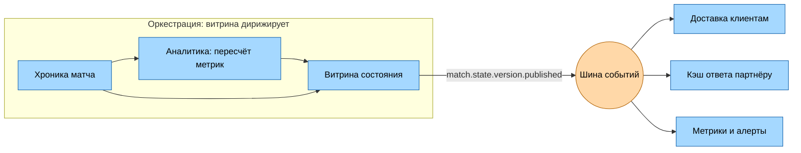

# Синхронное и асинхронное взаимодействие

Беру сценарии клиентов из [15-clients-and-scenarios.md](15-clients-and-scenarios.md) и внутренние шаги с доски [Event Storming](08-event-storming.md), размечаю где пользователь реально сидит и ждёт ответ, и уже из этого решаю что делать синхронно, а что асинхронно.

Главное ограничение прежнее и идёт из [ADR-01](adr/01-functional-suitability-over-performance.md): клиент видит только согласованную версию состояния. Поэтому асинхронность внутри системы не должна вылезать наружу кусочками - наружу отдаём либо целую версию, либо ничего.

## Кто чего ждёт

| Шаг                                 | Ждёт ли пользователь                   |
| ----------------------------------- | -------------------------------------- |
| Открыл матч, забирает снапшот       | Ждёт, это первый экран                 |
| Подписался на поток обновлений      | Ждёт только факт подписки              |
| Смотрит матч, приходят новые версии | Конкретного ответа не ждёт, но смотрит |
| Реконнект или возврат из фона       | Ждёт, но видит старые данные           |
| Партнёр пуллит пачку матчей         | Ждёт не человек, а чужой бэкенд        |
| Приём пакета от провайдера          | Провайдер ждёт только `200 OK`         |
| Ретраи и переключение источника     | Никто, но есть 45с из S1               |
| Пересчёт метрик и сборка версии     | Ждёт сервис, но не человек             |
| Отмена гола и пересчёт зависимых    | Ждёт клиент, но опосредованно(S5)      |

## Sync или async и почему

| Шаг                             | Решение                   | Обоснование одной строкой                                                           |
| ------------------------------- | ------------------------- | ----------------------------------------------------------------------------------- |
| Снапшот матча                   | sync                      | Это первый экран, до ответа показывать нечего                                       |
| Подписка на поток               | sync на установку         | Подтвердить подписку надо сразу, иначе клиент не знает с какой версии он стартовал  |
| Поток обновлений                | async, push               | Клиент не может спросить "что нового", потому что не знает когда забьют гол         |
| Реконнект и досыл               | sync на разницу версий    | Клиент говорит свою версию и ждёт новую версию, дальше снова живёт на потоке        |
| Пачка матчей партнёру           | sync                      | Партнёр спрашивает сам и держит соединение, пока не ответим                         |
| Приём и нормализация            | sync ответ, async дальше  | Провайдеру отвечаем сразу чтобы он не ретраил, а обработку кладём в очередь         |
| Ретраи и переключение источника | async                     | 45с ретраев по S1 нельзя держать ни в одном клиентском запросе                      |
| Арбитраж источников             | sync внутри шага          | Решение "кому верим" обязано быть принято до записи, иначе в хронике окажется мусор |
| Пересчёт метрик                 | async                     | Тяжёлый счёт с отдельным профилем нагрузки                                          |
| Сборка и публикация версии      | sync внутри, async наружу | Дождаться всех метрик надо явно, а вот кому нужна готовая версия - не наше дело     |
| Отмена гола                     | async                     | Цепочка компенсация-пересчёт-версия длиннее любого разумного ожидания в запросе     |

Отдельно про поток обновлений: снаружи это выглядит как async-доставка, но транспорт - долгоживущее соединение WS/SSE из [Возможности 6](04-capabilities.md), а не очередь. Клиент подписался один раз и получает версии по мере их появления.

## Оркестрация или хореография

Правило, по которому делю: оркестрация нужна там, где есть один владелец результата и он обязан дождаться всех шагов, прежде чем результат станет видимым. Хореография - там, где отправителю честно всё равно, кто и когда его услышит, и число слушателей будет расти.

**Оркеструем:**

- **Сборку согласованной версии.** Витрина состояния - дирижёр: знает какие метрики зависят от события, дожидается их всех и только потом публикует версию. Это буквально обещание из ADR-01, и размазать его по подписчикам нельзя.
- **Отмену события(S5).** Компенсирующее событие -> пересчёт зависимых -> новая версия. Набор шагов известен заранее, порядок важен, промежуточное состояние наружу показывать нельзя.
- **Арбитраж источников(S1).** Ретраи, таймауты, переключение на резервный - это алгоритм с состоянием и дедлайном, а не набор реакций.
- **Всё, что клиент запросил сам.** Снапшот, история, пачка партнёру - запрос-ответ через шлюз, координировать тут нечего.

**Отдаём хореографии:**

- `match.event.recorded` - хроника записала факт, слушают аналитика и витрина;
- `match.state.version.published` - главное событие системы, слушают доставка, кэш партнёрского ответа и метрики;
- `match.finished` - слушают лента событий(переезжает в `immutable`, см. [02-invalidation.md](17-caching/02-invalidation.md)) и биллинг;
- `source.marked.stale` - слушают алерты и пометка _устаревшие_ в UI.

Смысл разреза виден на публикации версии: витрина не знает и не хочет знать, что её версию слушают трое. Вызывай она их сама - четвёртый потребитель означал бы правку витрины, а падение доставки роняло бы публикацию.



Граница проходит так: слева тройка хроника-аналитика-витрина, самое связанное место системы по [06-cohesion-coupling.md](06-cohesion-coupling.md) - там оркестрация оправдана, потому что там живёт гарантия согласованности. Справа все, кто просто реагирует, и им хватает события.

## Пример контракта

### Эндпоинт: снапшот состояния матча

Тот самый первый экран дашборда.

```
GET /v1/matches/{matchId}/state
Authorization: Bearer <token>
```

Ответ `200 OK`:

```json
{
	"matchId": "m-8842",
	"version": 1274,
	"publishedAt": "2026-09-06T18:41:02.310Z",
	"status": "live",
	"stale": false,
	"score": { "home": 2, "away": 1 },
	"metrics": { "xg": { "home": 1.84, "away": 0.92 } },
	"lastEvents": [
		{
			"eventId": "ev-99321",
			"type": "goal",
			"minute": 63,
			"team": "home",
			"compensates": null
		}
	],
	"stream": {
		"url": "wss://api.example.com/v1/matches/m-8842/stream",
		"fromVersion": 1274
	}
}
```

Заголовки ответа: `Cache-Control: public, max-age=2`, `ETag: "m-8842:1274"`, `X-Trace-Id`.

Что тут важно:

- `version` монотонно растёт и является единицей согласованности - весь объект собран на одну версию, склеек из разных версий не бывает;
- `stale: true` - это сценарий S1: данные отдаём, но честно говорим что источник отвалился;
- `stream.fromVersion` закрывает спорное место H2 с доски Event Storming - клиент подписывается ровно с той версии, которую только что получил, и разрыва между снапшотом и потоком не остаётся;
- `compensates` держит отмену: у компенсирующего события тут стоит id отменяемого, а сам гол из ленты не пропадает.

Коды ошибок: `401` - нет или протух токен; `403` - матч не входит в тариф(доменное решение сервиса, не шлюза); `429` - лимит тарифа, с `Retry-After`; `503` - витрина не собрала ни одной версии. Метод безопасный и идемпотентный, клиентский таймаут 3с, ретрай с backoff разрешён.

### Событие: версия состояния опубликована

Главное async-событие системы.

**Топик**: `match.state.v1`
**Ключ партиционирования**: `matchId` - порядок версий внутри матча гарантирован, а разные матчи спокойно разъезжаются по партициям.
**Гарантия**: at-least-once, потребители обязаны быть идемпотентны по паре `matchId + version`.

```json
{
	"eventId": "01J9F2K8ZQ0T7WVH3M5NBRD4XC",
	"eventType": "match.state.version.published",
	"eventVersion": 1,
	"occurredAt": "2026-09-06T18:41:02.310Z",
	"traceId": "4bf92f3577b34da6a3ce929d0e0e4736",
	"payload": {
		"matchId": "m-8842",
		"version": 1274,
		"previousVersion": 1273,
		"reason": "goal_cancelled",
		"changed": ["score", "metrics.xg", "lastEvents"],
		"snapshotRef": "/v1/matches/m-8842/state?version=1274"
	}
}
```

Что тут важно:

- `previousVersion` даёт потребителю проверить, не пропустил ли он версию: если своя версия отстала больше чем на шаг, он идёт за снапшотом по `snapshotRef`, а не гадает;
- `reason` объясняет почему версия появилась, и по `goal_cancelled` доставка понимает, что клиенту надо не дорисовать, а перерисовать;
- `changed` позволяет доставке не гонять клиентам целую версию, когда поменялось одно поле;
- `eventVersion` и правило "незнакомые поля игнорируем" - это про клиента на старой версии из стора, который обновиться прямо сейчас не может;
- payload намеренно тонкий: полное состояние лежит за `snapshotRef`, потому что событие читают трое, а целиком оно нужно не всем.
