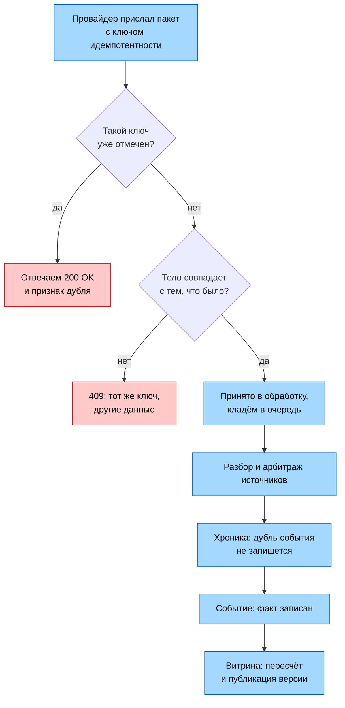

# Идемпотентность и коммутативность

Продолжение [18-sync-async.md](18-sync-async.md). Там разобраны интеграции, sync/async, оркестрация и контракты - здесь только то, чего в них не хватало: что происходит при повторе.

## Идемпотентность и коммутативность - разные вещи

**Идемпотентность** - повтор не меняет результат. **Коммутативность** - результат не зависит от порядка.

На моей теме:

- Инкремент счётчика тарифицированных запросов партнёра **коммутативен** (+1 и +1 в любом порядке дают +2), но **не идемпотентен** - повтор реально прибавит лишнее. Нужен ключ.
- Применение версии на клиенте по правилу "беру максимум" - и идемпотентно, и коммутативно. Защищать нечего.
- Пересчёт метрик **не коммутативен**, если считать инкрементально: прибавить владение мячом до отмены гола или после - разный результат. Поэтому аналитика считает от полной ленты событий матча, а не дельтой: так порядок прихода перестаёт иметь значение, и повторный пересчёт даёт тот же ответ

## Как вообще ловится повтор

Механика везде одна и та же, из двух частей.

1. **Ключ** - строка, по которой я узнаю "это та же самая операция, а не новая". Собирается из данных самой операции, а не выдаётся случайно: например, номер пакета от конкретного провайдера или пара "матч + номер версии". Два разных гола дадут разные ключи, а один и тот же гол, приехавший дважды, - одинаковые.
2. **Отметка** - запись, которая говорит "операцию с таким ключом я уже выполнил". Когда операция приходит, сервис сначала смотрит, есть ли отметка с её ключом. Есть - значит это повтор, работу заново не делаем. Нет - выполняем и оставляем отметку.

Дальше весь вопрос в том, **где эта отметка физически лежит**. Вариантов у меня два:

- **отдельное хранилище отметок** - список уже виденных ключей, который сервис ведёт специально для этой цели, рядом с основными данными, но не внутри них. Отметки в нём живут ограниченное время и потом удаляются, чтобы список не пух;
- **сами данные** - отметки как отдельной сущности нет, её роль играет запись в базе. База настроена так, что двух записей с одинаковым ключом в ней существовать не может, и вторая попытка просто отвергается. Отметка и результат операции - это один и тот же объект.

Второй вариант надёжнее, первый дешевле. Ниже видно, где я выбрал какой и почему.

## Критичные к повтору операции

| Операция                         | Ключ идемпотентности                                  | Где ставится отметка                                         | Что при повторе                         |
| -------------------------------- | ----------------------------------------------------- | ------------------------------------------------------------ | --------------------------------------- |
| Приём пакета от провайдера       | заголовок `Idempotency-Key`: провайдер + номер пакета | Отдельное хранилище отметок, срок жизни сутки                | `200 OK` и признак "это дубль"          |
| Запись события в хронику         | матч + провайдер + идентификатор события у источника  | Сами данные: двух событий с одним ключом в хронике не бывает | Повторная запись не создаётся           |
| Компенсация события (S5)         | матч + идентификатор отменяемого события              | Сами данные: у одного гола не может быть двух отмен          | Вторая отмена того же гола отвергается  |
| Пересчёт метрик                  | матч + номер версии                                   | Отдельное хранилище: журнал посчитанных версий               | Считается заново, результат тот же      |
| Публикация версии витриной       | матч + номер версии                                   | Сами данные: версия с таким номером в витрине одна           | Ничего не меняется, событие не издаётся |
| Доставка версии клиенту          | матч + номер версии                                   | На клиенте: номер последней применённой версии               | Версия не новее текущей отбрасывается   |
| Учёт запроса партнёра в биллинге | идентификатор запроса из заголовка                    | Сами данные: запрос с таким id учитывается один раз          | Дубль отбрасывается, деньги не растут   |

Место отметки важнее ключа. Ключ придумать легко, а вот от того, где лежит отметка, зависит, выдержит ли защита падение сервиса на середине.

### Почему для трёх операций отметка - это сами данные

Запись события в хронику, компенсация и биллинг - места, где отметка и результат обязаны появиться разом либо не появиться вовсе.

Если держать отметку отдельно, порядок получается такой: отметил ключ, потом записал данные. Между этими двумя шагами сервис может упасть. Тогда отметка есть, а данных нет - и повторная попытка провайдера будет отвергнута как дубль. Гол потеряется навсегда, причём тихо. Когда роль отметки играет сама запись, такого окна нет: либо запись появилась, либо нет, третьего состояния не существует.

Отдельное хранилище остаётся там, где худший исход - лишняя работа, а не порча данных: приём пакета (разберём дважды, а дальше нас всё равно поймает хроника) и пересчёт метрик (посчитаем второй раз и получим то же самое).

### Приём пакета: полный путь повтора

Два рубежа защиты, и это специально. Первый - отдельное хранилище отметок - ловит быстрый ретрай провайдера дёшево, не доводя дело до базы. Второй - сама хроника - ловит всё остальное: пакет, пришедший через сутки, когда отметка уже удалилась по сроку; тот же матч, приехавший от двух провайдеров с одним идентификатором события; повторную доставку из очереди. Одного первого рубежа не хватило бы: отметки в нём живут ограниченное время, а повторы приходить не перестают.

`409` в этой схеме - не повтор, а ошибка на стороне провайдера: тот же ключ пришёл с другими данными. Молча принять такое хуже, чем отказать.

## Чего сознательно не защищаю

- Запросы на чтение (снапшот, история, пачка партнёру) - безопасны по определению, повтор возвращает то же самое или новее.
- Установка подписки - повторная просто создаёт новое соединение, старое закрывается по таймауту. Ущерба нет.
- Опрос провайдера - это чтение чужих данных, мы ничего не меняем.
- Кэш партнёрского ответа - живёт на TTL по ключу "пачка + тариф" ([17-caching/02](17-caching/02-invalidation.md))
- Алерты - дубликат неприятен, но лечится дедупликацией на стороне алертинга, а не у меня.
