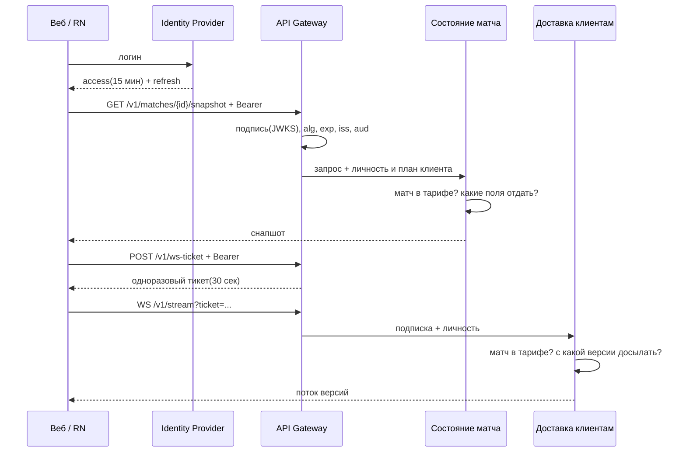

# Аутентификация и авторизация: кто входит и что ему можно

Продолжение [16-entry-layer.md](16-entry-layer.md). Там я одной строкой записал, что шлюз проверяет токен, а доменное "этот матч в твой тариф не входит" решает сервис. Здесь разворачиваю: кто у нас пользователи, где проверяется подпись токена, по какой модели считаются права и где стоит проверка принадлежности объекта.

## Роли

| Роль | Что видит и делает | Чего не видит |
| --- | --- | --- |
| Зритель (веб, RN) | матчи своего тарифа: счёт, события, полную ленту с компенсирующими; поток версий по WS | матчи вне тарифа; xG и владение без оплаченной аналитики; чужие подписки и избранное; служебные поля - какой провайдер дал данные |
| Партнёр (B2B) | пуллом матчи своего тарифа пачкой, историю после свистка, свой расход квоты | поток версий по WS(не его контракт); матчи вне тарифа; чужой расход и счёт |
| Оператор арбитража | по матчам своих лиг: какой источник выбран, где источники расходятся; вручную подтверждает или отклоняет спорное событие | матчи чужих лиг; данные зрителей и партнёрские счета; правку записанной истории - только компенсирующим событием([ADR-01](adr/01-functional-suitability-over-performance.md)) |
| Админ провайдеров | реестр провайдеров, уровни доверия, ключи | данные зрителей и партнёров; ручной арбитраж по матчам |
| Провайдер данных | пушит пакет событий в интеграцию | что-либо читать из системы |

Последняя строка - не человек, и это принципиально: проверяют его другим механизмом и в другом месте. У человека роль меняется в биллинге или в админке, у провайдера - при смене ключа.

Что вылезло из колонки "чего не видит":

- **Тариф - не роль.** Зритель один на всех, а набор матчей у каждого свой: зависит от плана и набора лиг в нём. И меняется в момент оплаты и отмены, то есть чаще, чем что-либо в наборе ролей.
- **Уровень детализации - тоже не роль.** Счёт видят все, xG - только по плану. Это тот же ответ, у которого вырезана часть полей.
- **У оператора и зрителя один экран матча, но разные основания доступа.** Зритель видит матч, потому что он в его тарифе, оператор - потому что матч в его лиге. Одна и та же версия состояния по двум разным правилам - ровно тот случай, ради которого дальше понадобится ABAC.

## Вход

Пароли мы не проверяем: вход отдан внешнему провайдеру личности(OIDC), система принимает результат.

**Подпись токена проверяется только на шлюзе** - подпись по JWKS, алгоритм по списку разрешённых, срок, `iss` и `aud`. Дальше внутрь идёт запрос с уже установленной личностью и планом; сервисы токен повторно не разбирают, своего JWKS у них нет. Шесть мест, которые сами разбирают токен, - это шесть мест, где можно забыть проверить `aud`.

Токен беру JWT, а не сессию во внешней проверке: на старте матча снапшот просят тысячами в секунду(D2/S2), и поход к провайдеру на каждый запрос стал бы новым узким местом ровно в пике. Плата - мгновенного отзыва access нет, окно вреда равно 15 минутам.

Три входа мимо этой схемы: **партнёры** приходят по client credentials(тот же провайдер, `clientId` становится ключом квоты), **провайдеры данных** - по подписи тела вебхука ключом из реестра плюс mTLS(требовать от них поход в наш Identity Provider нереально), **сервисы между собой** - по mTLS кластера. В запросах внутрь едут две личности сразу: кто вызывает и от чьего имени. Вторую терять нельзя - без неё сервис состояния матча не сможет ответить, входит ли матч в тариф, и вынужден будет отдать всё.

### Долгоживущий WS

Здесь у темы своя специфика. Браузерный WebSocket не даёт поставить заголовок `Authorization`. Токен в query отпадает - утечёт в наши же логи и трейсы на шлюзе; cookie не подходит для RN. Поэтому обмен на **одноразовый тикет** на 30 секунд обычным HTTP-запросом, механизм один для веба и RN.

Второе: access живёт 15 минут, а матч 90. Рвать соединение раз в 15 минут нельзя - реконнект в пике это то, от чего мы защищались в [14-degradation-map.md](14-degradation-map.md). Поэтому шлюз запоминает `exp` при апгрейде, а клиент до этого момента присылает свежий токен служебным сообщением по тому же соединению. Не прислал - закрываем понятным кодом, чтобы клиент обновился, а не ретраил вслепую.

### Хранение токена на клиенте

Access - в памяти(и в вебе, и в RN), refresh - в httpOnly + Secure + SameSite cookie в вебе и в Keychain/Keystore в RN. `localStorage` не берём: его читает любой скрипт на странице, а на дашборде живёт сторонняя аналитика. Плата - на перезагрузке access теряется и клиент делает лишний refresh; для нас дешево, перезагрузка и так означает новый снапшот.

Что из этого требуется от бэкенда и попадает в контракт: `POST /v1/auth/refresh` живёт на домене шлюза(иначе cookie на него не поедет, то есть шлюз обязан проксировать refresh); на refresh нужен CSRF-токен; `aud` указывает на наш публичный API; `ws-ticket` и сообщение обновления токена - часть публичного `/v1`, а не деталь шлюза, ломать их нельзя из-за старых версий из стора.

## Модель авторизации: RBAC + ABAC на три правила

Ролей четыре, меняются редко, хорошо читаются в аудите - RBAC отвечает на вопрос "пускать ли вообще к этому разделу": к админке арбитража, к реестру провайдеров, к партнёрскому пути. Но три правила через роли не выражаются:

1. **Зритель видит матчи своего тарифа.** Роль одна на всех, набор матчей у каждого свой. Заводить роль на каждую комбинацию план × лига - это десятки ролей, которые переписываются при каждой смене состава пакетов.
2. **Расширенная аналитика видна по оплаченному плану.** Роль "pro-зритель" технически возможна, но тогда факт оплаты живёт в системе ролей, а не в биллинге, и переезжает туда при каждой оплате и отмене.
3. **Оператор работает только со своими лигами.** Лига - атрибут матча и оператора. Закрепление меняется чаще состава ролей: сегодня он на РПЛ, завтра его перекинули на кубок.

Все три - про сравнение атрибута субъекта с атрибутом объекта, то есть ABAC. Полный ABAC на всё не беру: "админ управляет реестром провайдеров" выражается ролью, и переводить это в атрибуты значит терять читаемость там, где она была бесплатной. MAC не рассматривал - меток секретности снаружи у нас нет.

| Правило | Модель | Где считается |
| --- | --- | --- |
| Пускать ли к разделу(админка, реестр, партнёрский путь) | RBAC по роли | шлюз |
| Не превысил ли партнёр лимит тарифа | лимит по `clientId` | шлюз |
| Матч входит в тариф клиента | ABAC: `match.league ∈ subject.plan.leagues` | состояние матча, доставка |
| Поля расширенной аналитики видны | ABAC: `subject.plan.analytics` | состояние матча |
| Матч в лиге этого оператора | ABAC: `subject.leagues ∋ match.league` | арбитраж источников |

Отдельного policy-сервиса не завожу: правил три, все про собственные данные сервисов, а вынести их наружу значит дать policy-сервису знать состав тарифов и добавить точку отказа на путь каждого чтения снапшота - при тысяче запросов в секунду в пике.

Обратите внимание на две строки про партнёра: счёт запросов на шлюзе, потому что для него не надо знать, что такое матч. А какие матчи ему доступны - уже в сервисе. Это та же граница, по которой я делил шлюз и сервисы в [16-entry-layer.md](16-entry-layer.md).

## Где проверяется принадлежность объекта

| Операция | Что проверяется | Место проверки |
| --- | --- | --- |
| `GET /v1/matches/{id}/snapshot` | лига матча в плане клиента; поля аналитики вырезаются по плану | состояние матча |
| `GET /v1/matches/{id}/events` | то же | состояние матча, в условии выборки |
| `WS /v1/stream`, подписка | лига матча в плане; при досыле - что версия принадлежит этому матчу | доставка, при установке подписки |
| `DELETE /v1/subscriptions/{id}` | подписка принадлежит этому клиенту | доставка, она владеет подписками |
| `GET`/`DELETE /v1/favorites/{id}` | запись принадлежит этому зрителю | профиль зрителя, в условии выборки |
| `GET /v1/partner/matches?ids=...` | **каждый** id из пачки входит в тариф партнёра | состояние матча, в условии выборки |
| `GET /v1/partner/usage` | `clientId` из токена - владелец счёта | биллинг |
| `POST /v1/admin/matches/{id}/arbitration` | матч в лиге, закреплённой за оператором | арбитраж, до записи компенсирующего события |
| `PUT /v1/admin/providers/{id}` | роли достаточно, объект чужим не бывает | шлюз, проверки объекта нет |

Четыре вещи, на которых легко обжечься:

- **Проверка в условии выборки, а не фильтрацией после.** Особенно на партнёрской пачке: соблазн - выбрать все 50 id и отфильтровать. Отфильтровать список значит однажды забыть это сделать в новом эндпоинте и отдать всё.
- **На шлюз это вынести нельзя,** и причина не в принципе, а в фактах: шлюз не знает лигу матча и состав тарифа. Узнать может только сходив в сервис - проверка всё равно окажется там, просто через лишний вызов на каждый запрос в пике. Плюс на шлюзе стоит короткий кэш снапшота: решать доступ до кэша значит включать план в ключ кэша. Поэтому кэш держит **только базовую версию без полей аналитики**, а обогащённый вариант собирает сервис и на шлюзе не кэширует.
- **Проверка нужна и на потоке.** Подписка ставится один раз, версии летят 90 минут. Кончился план посреди матча - поток обязан заметить, поэтому доставка держит план в подписке и обновляет по событию из биллинга.
- **Код на чужой объект разный.** Матч вне тарифа - `403` с кодом "нужен другой план": расписание публично, факт существования матча не секрет, и клиенту надо показать покупку. Чужая подписка и избранное - `404`: там "нет прав" подтверждало бы, что запись существует, и перебором id собиралась бы картина чужих аккаунтов.

Решение о месте проверки записал отдельно: [ADR-04](adr/04-object-access-check-in-service.md).

## Чего сознательно не разбираю

Ротация ключей провайдера и кеширование JWKS - эксплуатация, к модели доступа отношения не имеет. Аудит решений оператора нужен(ручное решение меняет данные матча), но это блок наблюдаемости рядом с [13-slo-sli.md](13-slo-sli.md). Права внутри админки тоньше двух ролей - продуктовый вопрос, которого ещё нет. Персональные данные зрителей - это профиль и биллинг, generic-часть([Возможность 7](04-capabilities.md)).
