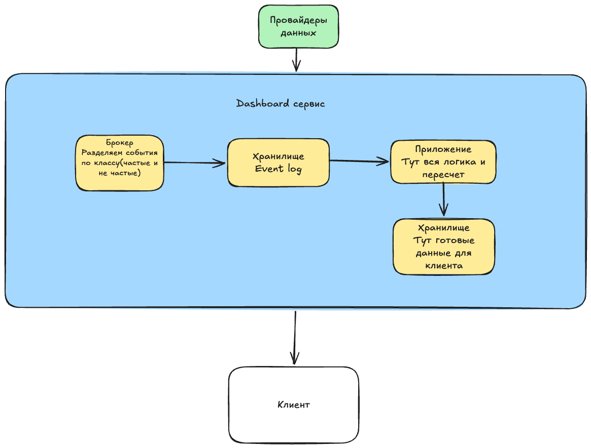

# C4, уровень 2 — Container

### Что здесь видно

После того как данные попали в сервис они разделяются по топикам в зависимости от класса события(редкое/важное и частое/не важное), далее записываются в event log(там события и компенсирующие события для отмены, то есть физически ничего не удаляется), потом само ядро с логикой и пересчетами, далее хранилище для быстрого чтения уже готового состояния. Далее данные попадают на клиент через вебсокет или через SSE
