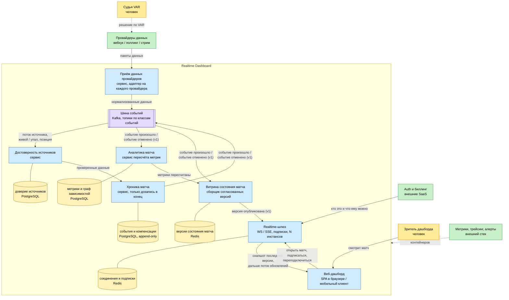

# C4, уровень 2 — Container

### Что здесь видно

Шесть сервисов по границам из [05-service-boundaries.md](../../05-service-boundaries.md), плюс шина событий и веб-дашборд. Данные идут сверху вниз: адаптер привёл чужой формат к нашему, достоверность решила каким данным верить, хроника записала факт в лог, аналитика пересчитала зависимые метрики, витрина собрала согласованную версию, шлюз разослал её по соединениям.

У каждого сервиса своё хранилище, общей БД нет. Где нужна история, там PostgreSQL, а версии состояния и таблица соединений в Redis, потому что читаются постоянно и перезапуск переживать не обязаны.

Шина стоит отдельным контейнером, и это главное отличие от [диаграммы сервисов](../../07-services-diagram.md), где на стрелках просто имена событий. Здесь важно, что стрелка это не вызов метода: хроника не знает, кто её читает, а аналитику можно перезапустить и догнать поток с нужного места.

Realtime-шлюз единственный держит состояние соединений и масштабируется по числу подписчиков, а не по потоку данных - пик на старте матча(D2, S2) прилетает именно сюда. У него две стрелки к дашборду: наружу снапшот последней версии и следом поток обновлений, внутрь - команды зрителя, включая переподключение. Обе политики разобраны на доске в [08-event-storming.md](../../08-event-storming.md).

Судья VAR своей стрелки в систему не имеет: он меняет решение у провайдера, а до нас доходит уже готовая отмена. Зритель, наоборот, командует напрямую через дашборд.
