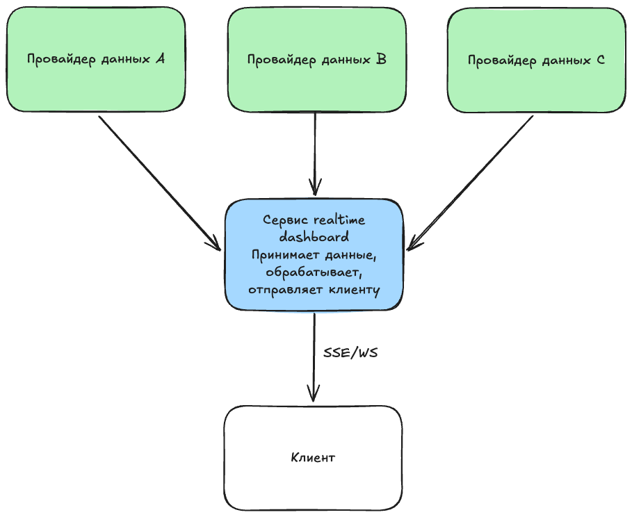

# C4, уровень 1 — System Context

### Что здесь видно

Система принимает данные от множества провайдеров. Провайдеры могут предоставлять уникальные данные, а могут дублировать данные. Дублирование данных нужно, чтобы была возможность переключаться между провайдерами если один из них откажет. Внутри системы есть модули приема, обработки и отправки данных. На выходе клиент/клиенты, которые общаются с сервисом через WebSocket или посредством SSE

[Исходник диаграммы](../c4.excalidraw)
