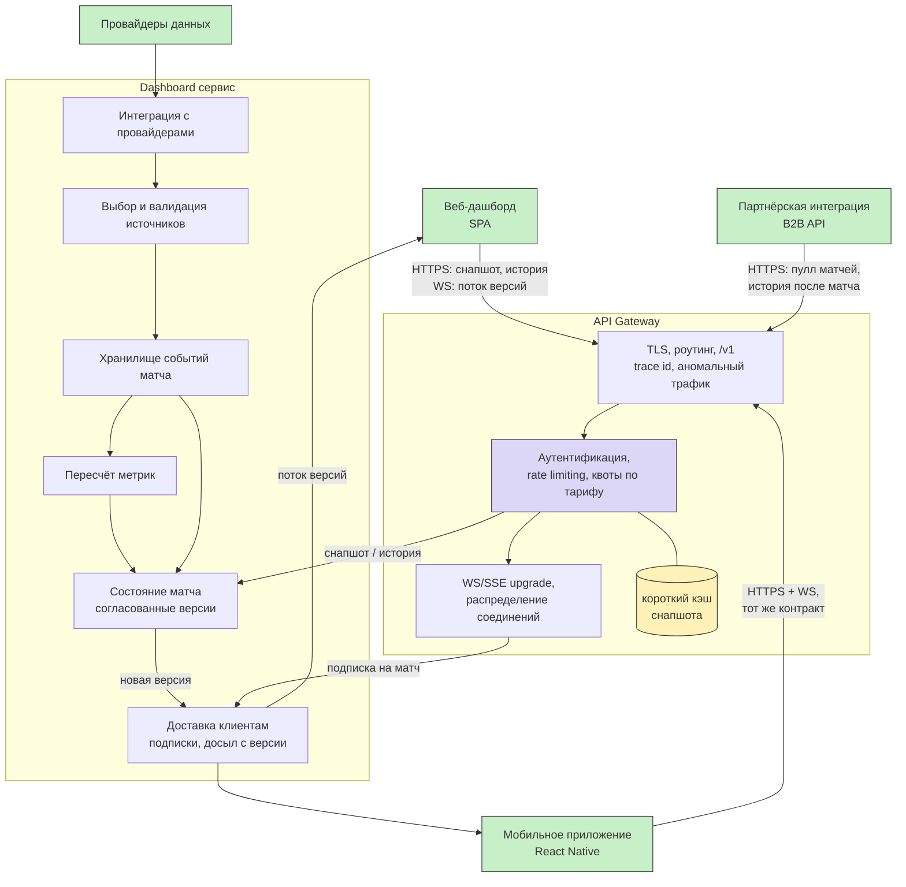

# Схема слоя входа: клиент → шлюз → сервисы

### Что здесь видно

Вход один на все три клиента, BFF-прослойки между шлюзом и сервисами нет: шлюз отдаёт запрос ровно одному сервису, а не собирает ответ из нескольких. Realtime и обычные запросы расходятся уже за шлюзом - поток версий идёт через доставку клиентам, снапшот и история берутся у состояния матча
